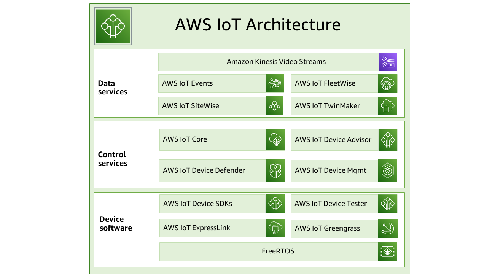

# What is AWS IoT
### AWS IoT provides device software that can help you integrate your IoT devices into AWS IoT-based solutions.
- If your devices can connect to AWS IoT, AWS IoT can connect them to the cloud servies that AWS provides.
- AWS IoT supports these protocols
    - MQTT (Message Queuing and Telemetry Transport)
    - MQTT over WSS (Websockets Secure)
    - HTTPS 
    - LoRaWAN (Long Range Wide Are Network)
        - Wireless LoRaWAN devices
        - AWS IoT core uses LNS (LoRaWAN network Server)
    - If AWS IoT features (device communications, rules, or jobs) then use **AWS Messaging**

---
### Flow and architecture of IoT and AWS 

- **IoT devices** operate in the data plane layer and communicate using protocols
    - MQTT, MQTT over WSS, HTTPS, and LoRaWAN.
    - These devices converge at `AWS IoT Core` which acts as a secure ingress, message broker, and routing hub.
- **IoT Core** separates data plane operations from the controlplane where _web, mobile, backend, and automation application interact with devices using:-_
    - AWS SKDs, AWS IoT APIs, and AWS CLI.
    - Controlplane manages device identities, configuration, jobs, and state (via `device shadows`)

> AWS IoT Core routes device data to other AWS services for storage, analytics, and event processing using rules, while security (certificates, policies, monitoring) is enforced across all interactions.

> Edge runtimes such as AWS `IoT Greengrass` allow local processing alongside cloud connectivity

---

## How your devices and apps access AWS IoT
###    1. AWS IoT Device SDKs - 
- Build applications on your devices that send messages to and receive messages from AWS IoT.

### 2. AWS IoT Core for LoRaWAN - 
- Connect and manage your long range WAN (LoRaWAN) devices and gateways by using `AWS IoT Core for LoRaWAN`

### 3. AWS CLI -
- Run commands for AWS IoT on Windows, macOS, and Linux.
- Commands allow you to create and manage _thing objects, certificate, rules, jobs, and policies._

### 4. AWS IoT API -
- Build your IoT applications using HTTP or HTTPS requests.
- API actions allow you to programmatically create and manage _thing objects, certificates, rules, and policies._

### 5. AWS SDKs-
- Build your IoT applications using language-specific APIs. 
- These SDKs wrap the HTTP/HTTPS API and allow you to program in any of the supported languages.

---

## 1. AWS IoT Services overview
 

AWS IoT provides services that support IoT devices that interact with the world and the data that passes between them and AWS IoT.
- Humans/Apps/K8s (Infra on Cloud) <------> AWS IoT <-------> device shadow <-----> IoT Devices.

### 1. Device Software
- __AWS IoT Device SDKs__
    - They include open-source libraries, developer guides with samples, and porting guides.
    - Help in building innovative IoT producsts or solutions on your  choice of hardware platform.
- __AWS IoT Device Transfer__
    - It is for `FreeRTOS` and AWS IoT `Greengrass`