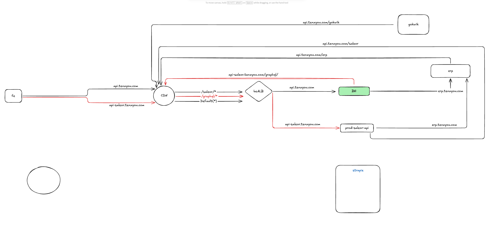
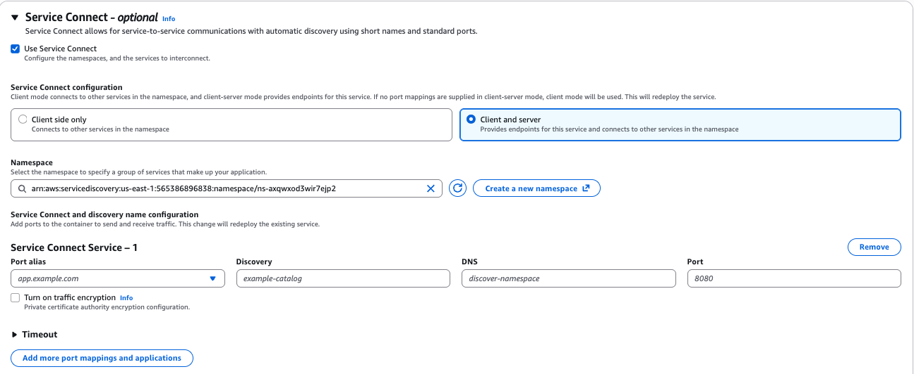

# ECS Service Connect – Implementation Notes

## Objective
Enable **internal service-to-service communication** between ECS services deployed
in private subnets so that backend components can communicate using **service names**
instead of public domain names, while ensuring traffic remains **inside the VPC**.

This implementation is based on the ECS Service Connect design documented here:
[04-cloud/aws/ecs.md – Internal Service-to-Service Communication](../../04-cloud/aws/ecs.md#internal-service-to-service-communication-service-connect)

---

## Context
- Backend services were running on ECS in private subnets
- Some dependent systems (ERP, Saleor) were running on standalone servers
- Internal ECS services were calling backend APIs via **public domains**
- This caused:
  - unnecessary NAT / internet traversal
  - higher latency
  - blurred separation between internal and external traffic

Goal was to keep **east-west traffic internal**, while preserving external access where needed.

**Reference Image**


---

## High-Level Approach
Use **ECS Service Connect**, backed by **AWS Cloud Map**, to provide:
- internal DNS-based service discovery
- stable service identities
- automatic routing via Envoy sidecars

---

## Implementation Steps

### Step 1: Create a Private Cloud Map Namespace
**Where**
>AWS Console → Cloud Map → Namespaces → Create namespace


**Configuration**
- Namespace type: Private
- Namespace name: `internal.myapp` (example)
- VPC: same VPC as ECS cluster

**Purpose**
- Defines the DNS boundary for internal service discovery
- No services or DNS records exist yet

---

### Step 2: Define Container Port in Task Definition
**Where**
>ECS → Task Definition → Container → Port mappings


**What was done**
- Defined the port on which the application listens (e.g. `8080`)
- ECS automatically generated a **port alias**

Example:
>Container port: 8080

>Port alias: backend-8080-tcp


**Notes**
- Port alias is required later by Service Connect
- No DNS or discovery happens at this stage

---

### Step 3: Enable Service Connect on ECS Service
**Where**
>ECS → Cluster → Service → Update service → Service Connect


This is the **core configuration step** where service identity is defined.

---

#### 3.1 Enable Service Connect
- Checked **Use Service Connect**
- Selected **Client and server**

**Reason**
- Client-only services cannot be discovered
- Client and server mode exposes an endpoint and allows discovery

---

#### 3.2 Select Namespace
- Selected the previously created Cloud Map namespace:
- >internal.myapp


**Effect**
- This namespace becomes the DNS suffix for all Service Connect services

---

#### 3.3 Configure Service Connect Service
Clicked **Add port mappings and applications**



Configured the following fields:

| Field | Value | Meaning |
|-----|------|--------|
Port alias | `<task-def-as-it-is>` | Container port mapping |
Discovery | `<anything>` | Logical service name |
DNS | `<anything>-<namespace>` | Let ECS derive DNS |
Port | `8080` | Application port |

**Important**
- `Discovery` is the **service name**
- `Namespace` is the **DNS suffix**
- ECS derives the internal DNS as:
>anything.internal.myapp


---

### Step 4: Repeat for Other ECS Services
- Enabled Service Connect on all backend ECS services
- Used the same namespace
- Assigned unique discovery names per service

---

### Step 5: Validation
From a running ECS task:

```bash
nslookup backend
