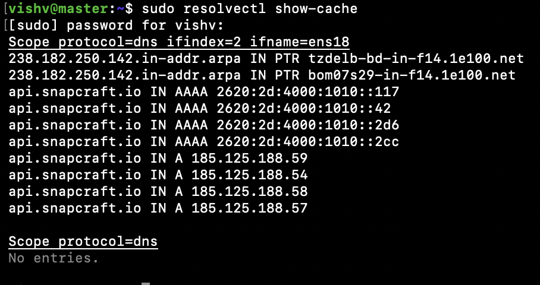
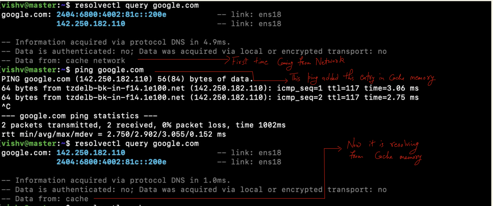

### How DNS Resolution works in Local setup
***
- ping google.com = ping calls system resolver library (getaddrinfo() = Resolver now)
- Resolver now looks for /etc/nsswitch.conf file, it looks for the file refertences in this file that will help in resolving DNS.

- 
- Now resolver looks for hosts: which has two entries _files_ and _dns_.
- _files_ = /etc/osts and _dns_ = dns server
### Flow
***
- Resolver checks = /etc/hosts
- Resolver then checks  = /etc/resolv.conf [127.0.0.53 nameserver] or Local DNS Server (Usually router).
- systemd-resolved (Linux sevice) listens on 127.0.0.53:53
    
    - It stores Cache DNS entries in RAM
    
    
       - #### How does entries goes in Local Cache
       >resolvectl query google.com

       - This tells if dns resolution coming from local or network cache

         - 
       > ping <domain.com>

       - This will add entries into the memory